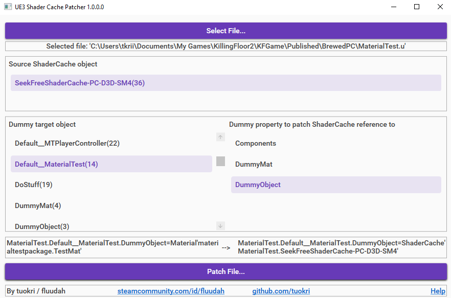

KF2 demo mutator for https://github.com/tuokri/UE3ShaderCachePatcher

How it works:

UE3 Shader Cache Patcher is used to set the object reference of `MaterialTestMutator.DummyObject` to `MaterialTest.SeekFreeShaderCache-PC-D3D-SM4`,
forcing the game into loading the shader cache when the mutator script package is loaded.

